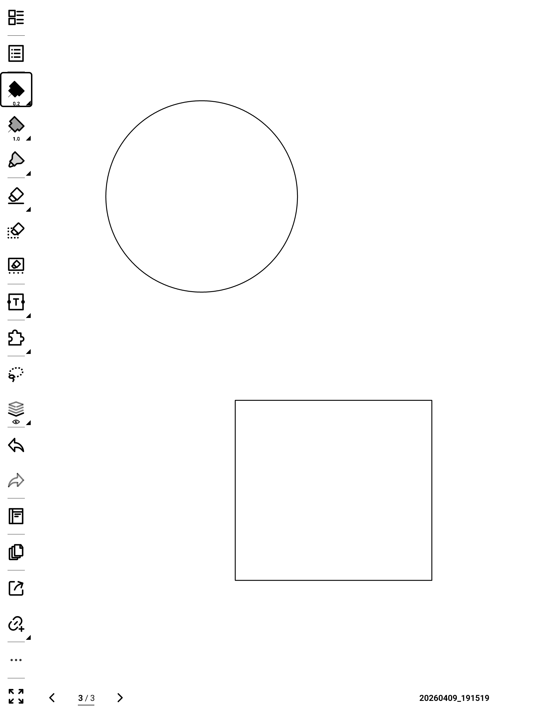

# Snap Shapes

Snap Shapes is a Supernote plugin that turns rough lasso-selected ink into clean geometry. It is designed for fast notebook use, conservative no-match behavior on non-shapes, and local write-back that avoids full-page flashing in ordinary cases.

## Example

<p align="center">
  
  
</p>

<p align="center">
  <em>Left: rough input. Right: snapped result.</em>
</p>

## Supported Shapes

- line
- circle
- ellipse
- triangle
- rectangle
- square
- pentagon
- hexagon
- heptagon
- octagon

## Current Behavior

- Works on lasso selections in `NOTE` and `DOC`
- Can snap multiple independent shapes inside one lasso
- Prefers local lasso replacement over full-page rewrite
- Ignores many text-like and scribbly selections instead of forcing a snap
- Regularizes near-horizontal and near-vertical geometry

## Repo Layout

- [docs/shape-snap-requirements.md](docs/shape-snap-requirements.md): product requirements
- [docs/shape-snap-algorithm.md](docs/shape-snap-algorithm.md): algorithm notes
- [docs/shape-snap-status.md](docs/shape-snap-status.md): current status and known issues
- [AGENTS.md](AGENTS.md): agent-oriented working notes, benchmarks, and iteration workflow

Key implementation files:

- [index.js](index.js)
- [src/shapeMatching.ts](src/shapeMatching.ts)
- [src/shapeSnap.ts](src/shapeSnap.ts)
- [src/exportDataset.ts](src/exportDataset.ts)

## Build

From the repo root:

```sh
npm install
npm run typecheck
npx jest __tests__/shapeMatching.test.ts __tests__/shapeSnap.test.ts --runInBand --watchman=false
npm run build:plugin
```

The packaged plugin is written to:

```text
build/outputs/supernote_shape_snap.snplg
```

## Install on Supernote

1. Copy the `.snplg` file to `MyStyle/`
2. On device, open `Settings -> Apps -> Plugins -> Add Plugin`
3. Install the package

## Notes

- The displayed plugin name is `Snap Shapes`
- The internal plugin key remains `supernote_shape_snap` for compatibility
- The package filename remains `supernote_shape_snap.snplg`
